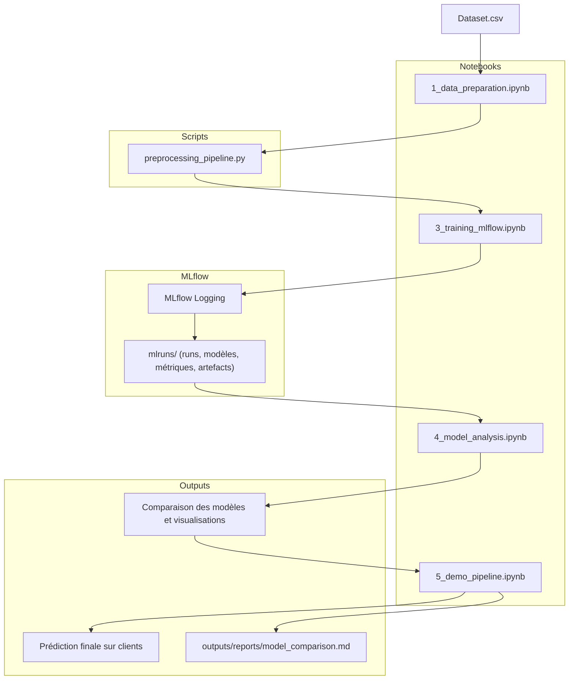

# 🧠 Churn Prediction avec MLflow

## 🎯 Objectif
Ce projet vise à **prédire le churn client** à partir de données bancaires, tout en **suivant et comparant les modèles ML** (Logistic Regression, Random Forest, XGBoost) via **MLflow**.


---

## 📂 Structure du projet
```bash
churn_prediction_mlflow/
│
├── data/
│   ├── dataset.csv                    # Données brutes
│   ├── processed_data.csv             # Données nettoyées/préparées (optionnel)
│
├── notebooks/
│   ├── 1_data_preparation.ipynb       # Exploration et nettoyage initial
│   ├── 3_training_mlflow.ipynb        # Entraînement + suivi MLflow
│   ├── 4_model_analysis.ipynb         # Comparaison des modèles (visualisations)
│   ├── 5_demo_pipeline.ipynb          # Démonstration du pipeline complet
│
├── src/
│   ├── preprocessing_pipeline.py      # Pipeline de nettoyage et feature engineering
│   ├── utils.py                       # Fonctions utilitaires (métriques, logging, etc.)
│   │
│   ├── models/                        # Scripts d’entraînement (modulaires)
│   │   ├── logistic_script.py         # Régression logistique
│   │   ├── forest_script.py           # Random Forest
│   │   ├── xgboost_script.py          # XGBoost
│
├── mlruns/                            # Répertoire généré automatiquement par MLflow
│   └── ...                            # Contient les runs, métriques, artefacts, modèles
│
├── outputs/
│   ├── figures/                       # Graphiques enregistrés dans MLflow et localement
│   ├── reports/                       # Résultats comparatifs
│   │   ├── model_comparison.md        # Rapport final (comparaison modèles)
│
├── tests/
│   ├── test_preprocessing.py          # Tests unitaires du pipeline
│   ├── test_models.py                 # Tests de reproductibilité et scoring
│
├── requirements.txt                   # Dépendances Python
├── README.md                          # Documentation du projet
├── .gitignore                         # Fichiers à ignorer dans Git
├── config.yaml                        # (Optionnel) paramètres globaux du projet
└── setup.sh                           # Script d’installation et lancement MLflow UI

```

---

## ⚙️ Installation

```bash
# Cloner le dépôt
git clone https://github.com/SalimM21/churn-prediction-mlflow.git
cd churn-prediction-mlflow

# Créer un environnement virtuel
python -m venv venv
source venv/bin/activate  # (ou venv\Scripts\activate sous Windows)

# Installer les dépendances
pip install -r requirements.txt
```
---

## 🚀 Exécution du pipeline complet

**1. Lancer le serveur MLflow**
```bash
mlflow ui
```
Accessible sur : http://localhost:5000

**2. Exécuter les notebooks dans l’ordre :**
- ``1_data_preparation.ipynb``
- ``2_preprocessing_pipeline.py``
- ``3_training_mlflow.ipynb``
- ``4_model_analysis.ipynb``
- ``5_demo_pipeline.ipynb``

**3. Afficher les runs dans MLflow UI**
- Comparer les métriques (``accuracy``, ``precision``, ``recall``, ``f1-score``)
- Identifier le meilleur modèle et ses hyperparamètres.

---

## 🧪 Critères de performance

1. Scripts fonctionnels et bien structurés
2. Utilisation correcte de mlflow.log_*
3. Gestion du déséquilibre (SMOTE / class_weight)
4. Comparaison claire des modèles
5. Visualisations et interprétations présentes

## 📚 Références

- [MLflow Documentation](https://www.mlflow.org/docs/latest/index.html)
- [Scikit-learn User Guide](https://scikit-learn.org/stable/user_guide.html)
- [XGBoost Documentation](https://xgboost.readthedocs.io/en/stable/)
- [Imbalanced-learn Documentation](https://imbalanced-learn.org/stable/)

